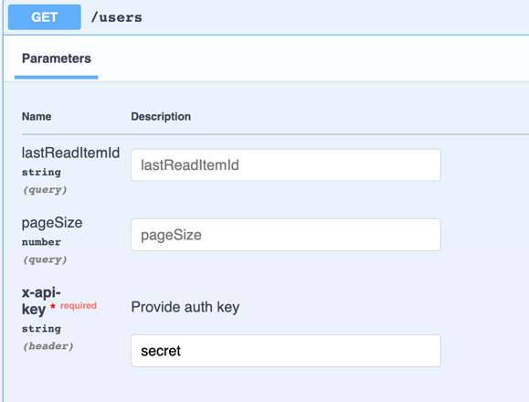

# nestjs-rest-api

NestJS Rest-Api powered by AWS RDS PostgreSQl

# App Start

1. Create .env file in the root and copy & paste mocked data from .sample-env
2. Edit .env file by writing correct credentials and other connection data
3. Run `yarn start:dev` (`npm run start:dev`) for development or `yarn start` (`npm start`) to up the server
4. Connect to swagger using `http://localhost:3000/docs` url. Provide simple auth typing `secret` in `x-auth-key` input
    

# Table updates

1. Change any entity class and save file
2. Run `NAME=Init npm run generate-migration` to generate a migration. Use custom names that are clear and correspond to
   table changes e.g. `NAME=AddPhoneNumberColumnToUser npm run generate-migration`
3. Make sure the recently generated migration is in `migrations` folder
4. Run `npm run run-migration` to apply migrations to the database
5. If you want to revert a migration, run `npm run revert-migration`, but note: it cancels the last migration

If you make `git clone` or `git pull` in a project, you should run all migrations (if there are some changes in tables
made by another dev) before development starting

Do not use `TABLE_SCHEMA_AUTOUPDATE=true` in prod

# Deploy to EC2 instance

1. Create an RDS Postgresql instance;
2. Connect to RDS and create a database;
3. Edit `scripts/install_project_dependencies.sh` by replacing your env variables;
4. Create an EC2 instance based on Amazon Linux and provide this script to `user data` input while creation to install
   the CodeDeploy Agent:

#!/bin/bash  
sudo yum -y update  
sudo yum -y install ruby  
sudo yum -y install wget  
sudo wget https://aws-codedeploy-us-east-1.s3.amazonaws.com/latest/install  
sudo chmod +x ./install  
sudo ./install auto  
