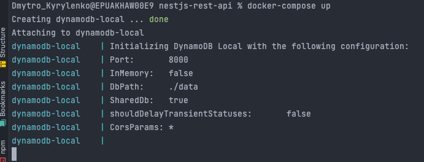
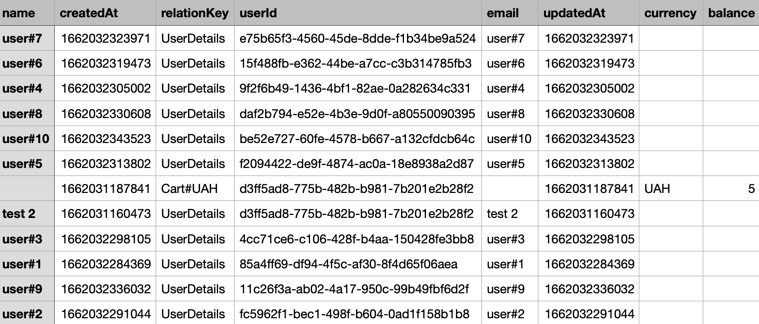

# nestjs-rest-api

NestJS Rest-Api powered by AWS DynamoDB

# Dynamodb Local Start

1. Install `Docker` (and `docker-compose` if you use Linux);
2. Open a console, navigate to the root of this project (using `cd`) and
   run `docker-compose up` (`sudo docker-compose up` for Linux),
   `docker-compose.yml` must be in the project. If you want to stop the db,
   use  `docker-compose down` (`sudo docker-compose down` for Linux);
3. If you see such statements in the console, db is up. If you faced some db local setting up
   issues, <a href="https://docs.aws.amazon.com/amazondynamodb/latest/developerguide/DynamoDBLocal.DownloadingAndRunning.html">
   check this resource<a/>
     
4. Install <a href="https://docs.aws.amazon.com/amazondynamodb/latest/developerguide/workbench.settingup.html">AWS NoSQL
   Workbench</a> for comfortable data visualization.

# App Start

1. Create .env file in the root and copy & paste mocked data from .sample-env
2. Edit .env file by writing correct credentials and other connection data
3. Run `yarn start:dev` (`npm run start:dev`) for development or `yarn start` (`npm start`) to up the server
4. Connect to swagger using `http://localhost:3000/docs` url. Provide simple auth typing `secret` in `x-auth-key` input
    

# Table schema at this project:

## `userId` is a hash key and `relationKey` is a range key

There is one entity called `User` that has nesting objects called `Carts`, in other words, `One User` to `Many Carts` (
One-To-Many)

# EC2 script on creation to install the CodeDeploy Agent:

#!/bin/bash  
sudo yum -y update  
sudo yum -y install ruby  
sudo yum -y install wget  
sudo wget https://aws-codedeploy-us-east-1.s3.amazonaws.com/latest/install  
sudo chmod +x ./install  
sudo ./install auto  

## Check code deploy service status `sudo service codedeploy-agent status`

# Recommendations:

Do not set `TABLE_AUTOUPDATE="true"` on prod, it's better to call `POST` `/system/update-tables-indexes` endpoint after
application is up to sync indexes that were changed in schema. If you call this endpoint to create some indexes, but
indexes are removed or vice-versa, try to call this endpoint one more time. There are some issues with `dynamoose`. Or
you can manually create indexes after schema updates, it's an alternative way to calling this endpoint.
